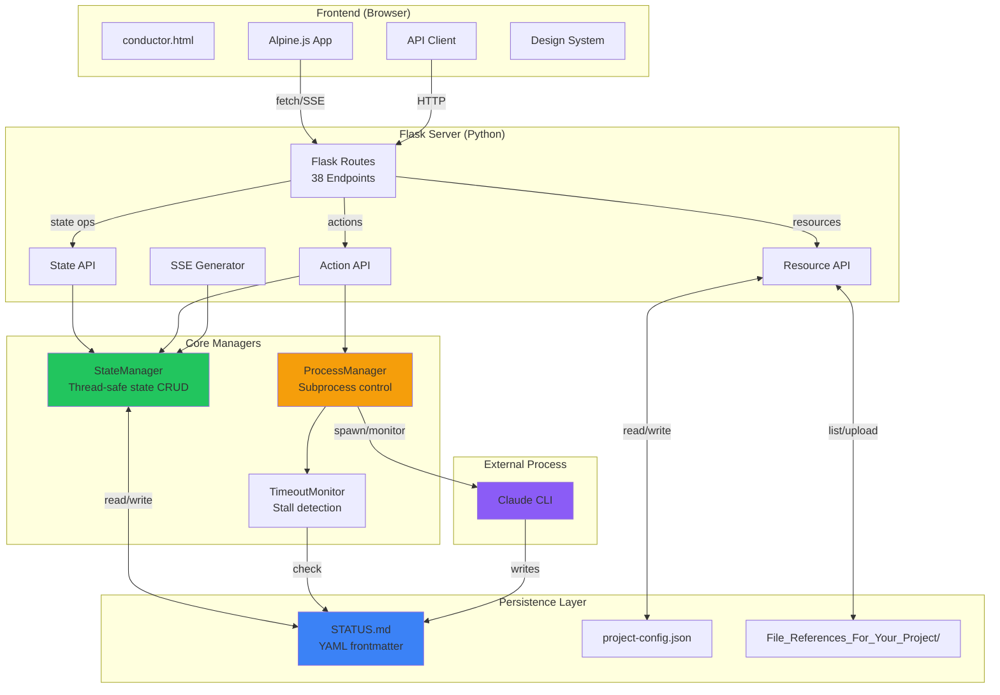
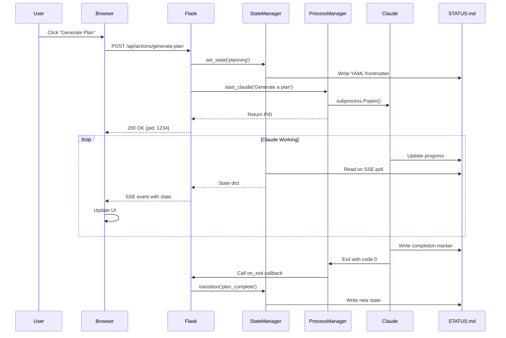
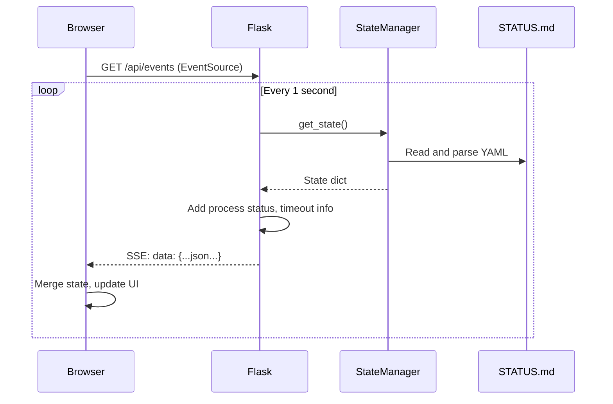
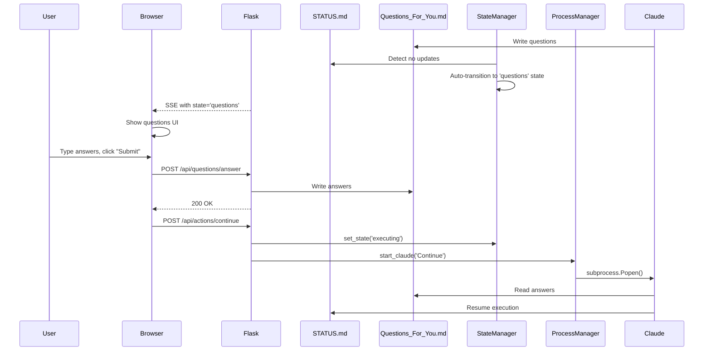

# Architecture

This document describes the architecture of the Simple Claude Conductor Web UI v2.0.

## System Overview

Simple Claude Conductor is a Flask-based web application that provides a GUI for managing Claude Code projects. It follows a layered architecture with clear separation of concerns.

## Component Diagram



## Architectural Layers

### 1. Frontend Layer (Browser)

**Technology**: HTML5, Alpine.js, Vanilla JavaScript, CSS Custom Properties

**Responsibilities**:
- Render UI based on application state
- Handle user interactions
- Maintain SSE connection for real-time updates
- Send HTTP requests to backend API

**Key Files**:
- `server/templates/conductor.html` - Main template
- `server/static/js/app.js` - Alpine.js application (conductorApp)
- `server/static/js/api.js` - API client with SSE support
- `server/static/css/conductor.css` - Design system

**Pattern**: Single Page Application (SPA) with server-side rendering of initial HTML.

### 2. API Layer (Flask Routes)

**Technology**: Flask with route decorators

**Responsibilities**:
- Expose REST endpoints for state and actions
- Stream real-time updates via SSE
- Handle file uploads and downloads
- Validate requests and return JSON responses
- Error handling with global exception handlers

**Key File**: `server/app.py`

**Endpoint Categories**:
- **State API** (2 endpoints) - Get current state
- **Action API** (6 endpoints) - Trigger state transitions
- **Resource API** (14 endpoints) - Manage config, references, questions
- **System API** (5 endpoints) - Claude status, file operations
- **SSE** (1 endpoint) - Real-time state stream

See [API_REFERENCE.md](API_REFERENCE.md) for complete endpoint documentation.

### 3. Business Logic Layer (Managers)

#### StateManager

**File**: `server/state_manager.py`

**Responsibilities**:
- Maintain application state in memory
- Persist state to STATUS.md with YAML frontmatter
- Enforce state machine transitions
- Provide thread-safe state operations
- Parse legacy STATUS.md formats for backward compatibility

**Key Methods**:
- `get_state()` - Read current state from STATUS.md
- `set_state(state, **kwargs)` - Directly set state (for init/recovery)
- `transition(action, **kwargs)` - Perform validated state transition
- `update_phase(phase, total, name)` - Update phase progress
- `set_error(message)` - Transition to error state

**Thread Safety**: Uses `threading.RLock` for internal synchronization, optional `portalocker` for file locking.

#### ProcessManager

**File**: `server/process_manager.py`

**Responsibilities**:
- Start Claude subprocess with proper PID tracking
- Monitor process health
- Capture output (when not using new console)
- Detect process exit and trigger callbacks
- Stop process gracefully with timeout

**Key Methods**:
- `start_claude(prompt, working_dir, new_console)` - Start subprocess
- `is_running()` - Check if process is alive
- `get_pid()` - Get process ID
- `stop(timeout)` - Gracefully terminate process
- `on_exit(callback)` - Register exit callback

**Platform Handling**: Uses `subprocess.CREATE_NEW_CONSOLE` on Windows for proper console window management.

#### TimeoutMonitor

**File**: `server/process_manager.py`

**Responsibilities**:
- Monitor STATUS.md modification time
- Detect stalled processes (5 min without update)
- Detect hard timeout (30 min total runtime)
- Report timeout conditions via SSE

**Key Methods**:
- `start()` - Mark process start time
- `stop()` - Clear process start time
- `check()` - Return timeout status dict

### 4. Persistence Layer

#### STATUS.md (YAML Frontmatter)

**Format**:
```yaml
---
state: string
phase: number
total_phases: number
phase_name: string|null
process_id: number|null
process_start: ISO8601|null
last_updated: ISO8601
error: string|null
previous_state: string|null
activity: string
---
# Project Status: [Project Name]

**Last Updated**: YYYY-MM-DD HH:MM

---

## 👉 WHAT TO DO NEXT

[Human-readable activity message]

---

## Quick Status

| Item | Status |
|------|--------|
| Plan Generated | Yes/No |
| Current Phase | Phase X of Y: Name |
| Phases Completed | X / Y |

---

## Progress Log

[Progress details]
```

**Design**: Single source of truth serving both machines (YAML) and humans (Markdown).

**Write Pattern**: StateManager writes entire file atomically on every state change.

**Read Pattern**: StateManager parses YAML frontmatter on every `get_state()` call.

#### project-config.json

**Format**:
```json
{
  "projectName": "My Project",
  "projectDescription": "Build a tool that...",
  "defaultModel": "sonnet"
}
```

**Location**: `config/project-config.json`

**Purpose**: Store project configuration separately from state.

#### Reference Files

**Location**: `File_References_For_Your_Project/`

**Purpose**: User-uploaded files that Claude should read during planning (sample data, templates, screenshots, etc.).

**Management**: Upload via drag-and-drop, list via API, archive when resetting project.

### 5. External Process Layer

#### Claude CLI

**Communication**: The Flask server spawns Claude as a subprocess using:
```python
subprocess.Popen(['claude', '-p', prompt], ...)
```

**Integration Points**:
- **Input**: Command-line prompt (`-p` flag)
- **Output**: Claude writes to STATUS.md and other planning files
- **Monitoring**: ProcessManager tracks PID and detects exit
- **State Sync**: StateManager reads STATUS.md to detect Claude's progress

**Why No Stdout Capture?** When using `CREATE_NEW_CONSOLE` on Windows, the subprocess gets its own console for user visibility. Output capture would require removing the new console, hiding Claude's activity from users.

## Data Flow

### Scenario 1: Generate Plan



### Scenario 2: Real-time State Updates (SSE)



### Scenario 3: Answer Questions



## Design Decisions

### Why YAML Frontmatter in STATUS.md?

**Alternative Considered**: Separate state.json file

**Chosen Approach**: YAML frontmatter in STATUS.md

**Rationale**:
1. **Single Source of Truth**: One file for both machine state and human progress
2. **User Visibility**: Users can open STATUS.md and see both technical state and progress
3. **Claude Integration**: Claude already writes to STATUS.md, no additional file to sync
4. **Simplicity**: No need to keep two files in sync
5. **Git-friendly**: YAML frontmatter is a common pattern in static site generators

### Why Direct subprocess.Popen Instead of cmd /c start?

**Alternative Considered**: `subprocess.Popen(['cmd', '/c', 'start', 'claude', ...])`

**Chosen Approach**: Direct `subprocess.Popen(['claude', '-p', prompt])`

**Rationale**:
1. **PID Tracking**: Direct spawn gives us the actual PID of claude.exe
2. **Exit Detection**: Can wait() on the process and detect completion
3. **Process Control**: Can terminate/kill the process reliably
4. **cmd /c start Issues**: Returns immediately with cmd.exe's PID, not claude.exe's PID

**Windows Console**: Use `CREATE_NEW_CONSOLE` flag to give Claude its own window without losing PID tracking.

### Why Alpine.js Instead of React/Vue?

**Alternatives Considered**: React, Vue, Svelte

**Chosen Approach**: Alpine.js

**Rationale**:
1. **No Build Step**: Drop-in script tag, no npm/webpack/vite required
2. **Lightweight**: ~15KB minified, perfect for simple UIs
3. **Progressive Enhancement**: Works with server-rendered HTML
4. **Reactivity**: Provides Vue-like reactivity without framework overhead
5. **Simplicity**: Easy for non-experts to understand and modify

### Why SSE Instead of WebSockets?

**Alternative Considered**: WebSockets

**Chosen Approach**: Server-Sent Events (SSE)

**Rationale**:
1. **Unidirectional**: We only need server→client updates, not client→server real-time messages
2. **Simpler Protocol**: SSE uses regular HTTP, no upgrade handshake
3. **Auto-reconnect**: EventSource handles reconnection automatically
4. **Firewall Friendly**: Works over standard HTTP/HTTPS
5. **Less Code**: Simpler to implement than WebSocket server

### Why File-based State Instead of Database?

**Alternative Considered**: SQLite or JSON file

**Chosen Approach**: YAML frontmatter in markdown files

**Rationale**:
1. **Human Readable**: Users can inspect state by opening files
2. **Git-friendly**: Text files work well with version control
3. **No Dependencies**: No database driver or ORM needed
4. **Claude Integration**: Claude already writes to these files
5. **Simplicity**: Matches the philosophy of Simple Claude Conductor

## Scalability Considerations

### Current Limitations

1. **Single Project**: Server manages one project at a time
2. **Single User**: No authentication or multi-user support
3. **Local Only**: Designed for localhost, not production deployment
4. **File Locking**: Optional portalocker for concurrent access, but not battle-tested

### If Scaling Were Needed

1. **Multi-project**: Add project_id to all operations, store configs in separate directories
2. **Multi-user**: Add authentication layer, per-user project isolation
3. **Production**: Add WSGI server (gunicorn), reverse proxy (nginx), HTTPS
4. **Database**: Migrate from file-based state to PostgreSQL for better concurrency
5. **WebSocket**: Replace SSE with WebSocket for bidirectional communication

**Note**: Current design prioritizes simplicity over scalability. It's meant for local development workflows, not production services.

## Security Considerations

### Current Security Posture

**Good**:
- Runs on localhost only (127.0.0.1, not 0.0.0.0)
- No authentication needed (single user on local machine)
- File paths sanitized in upload handlers
- Subprocess runs as current user (no privilege escalation)

**Limitations**:
- No CSRF protection (not needed for localhost)
- No rate limiting (not needed for single user)
- No input sanitization for Claude prompts (trust user input)
- No file type restrictions on uploads

**If Exposing Publicly**:
- Add authentication (JWT or session-based)
- Add CSRF tokens
- Validate and sanitize all inputs
- Restrict file upload types and sizes
- Use HTTPS
- Add rate limiting
- Run in isolated container

## Testing Considerations

### Current Testing Approach

**Manual Testing**: The system is primarily tested manually via the web UI.

### Recommended Testing Strategy

1. **Unit Tests**:
   - StateManager state transitions
   - ProcessManager PID tracking
   - YAML frontmatter parsing

2. **Integration Tests**:
   - API endpoints with mock StateManager
   - SSE stream generation
   - File upload handling

3. **E2E Tests**:
   - Full workflow: configure → plan → execute → complete
   - Error handling and retry
   - Question answering flow

**Testing Framework**: pytest for Python, Playwright for E2E

## Future Enhancements

Potential improvements for v3.0:

1. **Plan Editing**: Allow editing generated plans before execution
2. **Pause/Resume**: Pause execution and resume later
3. **History View**: Show history of past runs with metrics
4. **Cost Tracking**: Display API cost estimates in real-time
5. **Parallel Execution**: Run multiple independent phases in parallel
6. **Custom Workflows**: Define reusable workflow templates
7. **Notifications**: Desktop notifications for completion/errors
8. **Cloud Sync**: Optional sync to Claude.ai for remote access

## Related Documentation

- [STATE_MACHINE.md](STATE_MACHINE.md) - Complete state machine specification
- [PROCESS_MANAGEMENT.md](PROCESS_MANAGEMENT.md) - Subprocess handling details
- [API_REFERENCE.md](API_REFERENCE.md) - REST API documentation
- [FRONTEND.md](FRONTEND.md) - Frontend architecture and patterns
