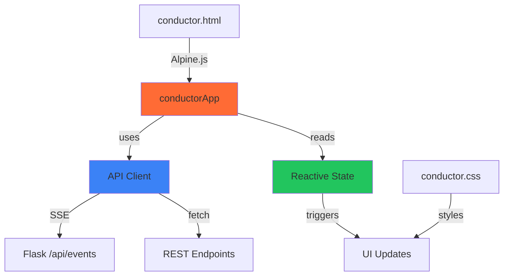

# Frontend Architecture

This document describes the frontend architecture of the Simple Claude Conductor Web UI, including Alpine.js structure, SSE integration, and design system.

## Technology Stack

- **Alpine.js 3.x** - Reactive framework
- **Vanilla JavaScript** - API client and SSE handling
- **CSS Custom Properties** - Design system tokens
- **No Build Step** - Drop-in script tags, runs directly in browser

## Architecture Overview



## Alpine.js Application Structure

**File**: `server/static/js/app.js`

**Entry Point**: `conductorApp()` function

### Application Initialization

```javascript
function conductorApp() {
    return {
        // Connection state
        connected: true,
        loading: false,
        lastUpdateTime: null,
        secondsSinceUpdate: 0,

        // Application state (from server)
        state: {
            state: 'reset',
            phase: 0,
            total_phases: 0,
            phase_name: null,
            process_id: null,
            error: null,
            activity: 'Ready to start'
        },

        // ... more state ...

        async init() {
            // Load initial state
            await this.loadState();
            await this.loadConfig();
            await this.checkSystem();
            await this.loadReferenceFiles();

            // Connect SSE
            api.onStateUpdate = (data) => this.handleStateUpdate(data);
            api.onConnectionChange = (connected) => this.connected = connected;
            api.connectSSE();

            // Start heartbeat timer
            this.lastUpdateTime = Date.now();
            setInterval(() => {
                this.secondsSinceUpdate = Math.floor((Date.now() - this.lastUpdateTime) / 1000);
            }, 1000);
        }
    };
}
```

**HTML Usage**:
```html
<body x-data="conductorApp()" x-init="init()">
    <!-- UI elements bound to state -->
</body>
```

### State Structure

#### Connection State
```javascript
connected: true,           // SSE connection status
loading: false,            // Operation in progress
lastUpdateTime: null,      // Last SSE event timestamp
secondsSinceUpdate: 0      // Heartbeat counter
```

#### Server State (from SSE)
```javascript
state: {
    state: 'executing',        // Current state machine state
    phase: 2,                  // Current phase number
    total_phases: 5,           // Total phases in plan
    phase_name: 'Implementation', // Current phase name
    process_id: 1234,          // Claude PID if running
    error: null,               // Error message if any
    activity: 'Working on...'  // Human-readable activity
}
```

#### Configuration State
```javascript
config: {
    projectName: '',           // Project name
    projectDescription: '',    // What to build
    defaultModel: 'sonnet'     // haiku | sonnet | opus
},
configExpanded: true          // Config panel collapsed/expanded
```

#### Reference Files State
```javascript
referenceFiles: [],           // List of uploaded files
noReferenceFiles: false,      // "I have no reference files" checkbox
isDragging: false             // Drag-and-drop visual feedback
```

#### Questions State
```javascript
questions: [                  // Questions from Claude
    {
        number: 1,
        topic: 'Auth Method',
        question: 'JWT or sessions?',
        answer: ''            // User's answer
    }
]
```

#### System State
```javascript
system: {
    installed: false,         // Claude CLI installed
    email: null,              // Logged in email
    version: null             // Claude version
}
```

### Computed Properties

#### statusDotClass
**Purpose**: CSS class for status indicator dot

```javascript
get statusDotClass() {
    const classes = {
        'complete': 'status-dot--success',
        'executing': 'status-dot--warning',
        'planning': 'status-dot--warning',
        'planned': 'status-dot--success',
        'questions': 'status-dot--warning',
        'error': 'status-dot--error'
    };
    return classes[this.state.state] || 'status-dot--neutral';
}
```

**HTML Usage**:
```html
<div class="status-dot" :class="statusDotClass"></div>
```

#### statusTitle
**Purpose**: Human-readable status title

```javascript
get statusTitle() {
    const titles = {
        'reset': 'Ready to Start',
        'configured': 'Ready to Generate Plan',
        'planning': 'Generating Plan...',
        'planned': 'Plan Ready',
        'executing': 'Executing...',
        'questions': 'Questions Pending',
        'complete': 'Project Complete!',
        'error': 'Error Occurred'
    };
    return titles[this.state.state] || 'Unknown State';
}
```

#### actionButtonText
**Purpose**: Dynamic primary button label

```javascript
get actionButtonText() {
    if (this.loading) return 'Working...';
    const texts = {
        'reset': 'Generate Plan',
        'configured': 'Generate Plan',
        'planning': 'Planning...',
        'planned': 'Execute Plan',
        'executing': 'Executing...',
        'questions': 'Submit Answers',
        'complete': 'Start New Project',
        'error': 'Retry'
    };
    return texts[this.state.state] || 'Action';
}
```

#### canPerformAction
**Purpose**: Disable action button during invalid states

```javascript
get canPerformAction() {
    if (this.loading) return false;
    // Can't act during auto-transition states
    if (['planning', 'executing'].includes(this.state.state)) return false;

    // For generate plan, require config and reference files
    if (['reset', 'configured'].includes(this.state.state)) {
        const hasConfig = this.config.projectName.trim() &&
                         this.config.projectDescription.trim();
        const hasRefFiles = this.referenceFiles.length > 0 ||
                           this.noReferenceFiles;
        return hasConfig && hasRefFiles;
    }

    return true;
}
```

**HTML Usage**:
```html
<button @click="performAction" :disabled="!canPerformAction">
    <span x-text="actionButtonText"></span>
</button>
```

#### progressPercent
**Purpose**: Calculate phase completion percentage

```javascript
get progressPercent() {
    if (this.state.total_phases === 0) return 0;
    return Math.round((this.state.phase / this.state.total_phases) * 100);
}
```

#### phaseLabel
**Purpose**: Format phase progress label

```javascript
get phaseLabel() {
    if (this.state.total_phases === 0) return 'No phases';
    const name = this.state.phase_name || '';
    if (name) {
        return `Phase ${this.state.phase} of ${this.state.total_phases}: ${name}`;
    }
    return `Phase ${this.state.phase} of ${this.state.total_phases}`;
}
```

#### heartbeatText
**Purpose**: Connection status message

```javascript
get heartbeatText() {
    if (this.secondsSinceUpdate < 2) {
        return 'Connected - receiving updates';
    } else if (this.secondsSinceUpdate < 10) {
        return `Last update: ${this.secondsSinceUpdate}s ago`;
    } else {
        return `Last update: ${this.secondsSinceUpdate}s ago (still working...)`;
    }
}
```

### Key Methods

#### performAction()
**Purpose**: Execute primary action based on current state

```javascript
async performAction() {
    this.loading = true;
    try {
        switch (this.state.state) {
            case 'reset':
            case 'configured':
                await api.saveConfig(this.config);
                await api.generatePlan();
                break;
            case 'planned':
                await api.executePlan();
                break;
            case 'questions':
                await this.submitAnswers();
                return;
            case 'complete':
                await this.resetProject();
                return;
            case 'error':
                await api.retry();
                break;
        }
    } catch (e) {
        alert('Action failed: ' + e.message);
    } finally {
        this.loading = false;
    }
}
```

#### handleStateUpdate(data)
**Purpose**: Process SSE state updates

```javascript
handleStateUpdate(data) {
    // Merge server state
    this.state = { ...this.state, ...data };

    // Reset heartbeat
    this.lastUpdateTime = Date.now();
    this.secondsSinceUpdate = 0;

    // Auto-load questions
    if (this.state.state === 'questions' && this.questions.length === 0) {
        this.loadQuestions();
    }

    // Auto-collapse config
    if (this.state.state === 'complete') {
        this.configExpanded = false;
    }
}
```

## API Client

**File**: `server/static/js/api.js`

**Class**: `APIClient`

### SSE Connection

```javascript
connectSSE() {
    if (this.eventSource) {
        this.eventSource.close();
    }

    this.eventSource = new EventSource(`${this.baseURL}/events`);

    this.eventSource.onopen = () => {
        console.log('SSE connected');
        this.reconnectAttempts = 0;
        if (this.onConnectionChange) {
            this.onConnectionChange(true);
        }
    };

    this.eventSource.onmessage = (event) => {
        try {
            const data = JSON.parse(event.data);
            if (this.onStateUpdate) {
                this.onStateUpdate(data);
            }
        } catch (e) {
            console.error('Failed to parse SSE data:', e);
        }
    };

    this.eventSource.onerror = () => {
        console.log('SSE disconnected');
        if (this.onConnectionChange) {
            this.onConnectionChange(false);
        }

        // Auto-reconnect (up to 10 attempts)
        this.reconnectAttempts++;
        if (this.reconnectAttempts > this.maxReconnectAttempts) {
            this.eventSource.close();
        }
    };
}
```

**Usage in App**:
```javascript
api.onStateUpdate = (data) => this.handleStateUpdate(data);
api.onConnectionChange = (connected) => this.connected = connected;
api.connectSSE();
```

### Fetch Wrapper

```javascript
async request(endpoint, options = {}) {
    const url = `${this.baseURL}${endpoint}`;
    const config = {
        headers: {
            'Content-Type': 'application/json',
        },
        ...options,
    };

    if (config.body && typeof config.body === 'object') {
        config.body = JSON.stringify(config.body);
    }

    try {
        const response = await fetch(url, config);

        if (!response.ok) {
            const error = await response.json().catch(() => ({
                error: response.statusText
            }));
            throw new Error(error.error || `HTTP ${response.status}`);
        }

        return response.json();
    } catch (e) {
        if (e.name === 'TypeError' && e.message === 'Failed to fetch') {
            throw new Error('Unable to connect to server. Is it running?');
        }
        throw e;
    }
}
```

### Convenience Methods

```javascript
// HTTP methods
get(endpoint) { return this.request(endpoint); }
post(endpoint, data = {}) {
    return this.request(endpoint, { method: 'POST', body: data });
}

// State API
getState() { return this.get('/state'); }

// Actions
generatePlan() { return this.post('/actions/generate-plan', {}); }
executePlan() { return this.post('/actions/execute', {}); }
cancel() { return this.post('/actions/cancel', {}); }

// Configuration
getConfig() { return this.get('/config'); }
saveConfig(config) { return this.post('/config', config); }

// Questions
getQuestions() { return this.get('/questions'); }
submitAnswers(answers) {
    return this.post('/questions/answer', { answers });
}
```

## Design System

**File**: `server/static/css/conductor.css`

### CSS Custom Properties (Design Tokens)

```css
:root {
    /* Colors */
    --color-primary: #ff6b35;      /* Orange */
    --color-primary-dark: #e55a2b;
    --color-success: #22c55e;      /* Green */
    --color-warning: #f59e0b;      /* Yellow */
    --color-error: #ef4444;        /* Red */
    --color-neutral: #6b7280;      /* Gray */

    /* Backgrounds (Dark Theme) */
    --bg-body: #111827;
    --bg-card: #1f2937;
    --bg-input: #374151;
    --bg-hover: #374151;

    /* Text */
    --text-primary: #f9fafb;
    --text-secondary: #9ca3af;
    --text-muted: #6b7280;

    /* Borders */
    --border-color: #374151;
    --border-radius: 8px;
    --border-radius-lg: 12px;

    /* Spacing */
    --space-xs: 0.25rem;
    --space-sm: 0.5rem;
    --space-md: 1rem;
    --space-lg: 1.5rem;
    --space-xl: 2rem;

    /* Typography */
    --font-family: -apple-system, BlinkMacSystemFont, 'Segoe UI', Roboto, sans-serif;
    --font-size-sm: 0.875rem;
    --font-size-base: 1rem;
    --font-size-lg: 1.125rem;
    --font-size-xl: 1.5rem;

    /* Transitions */
    --transition-fast: 150ms ease;
    --transition-normal: 250ms ease;
}
```

### Component Library

#### Cards

```css
.card {
    background: var(--bg-card);
    border-radius: var(--border-radius-lg);
    border: 1px solid var(--border-color);
    padding: var(--space-lg);
    margin-bottom: var(--space-lg);
}

.card__header {
    display: flex;
    align-items: center;
    gap: var(--space-sm);
    margin-bottom: var(--space-md);
}
```

**HTML Usage**:
```html
<div class="card">
    <div class="card__header">
        <h2>Card Title</h2>
    </div>
    <p>Card content...</p>
</div>
```

#### Stage Progress Indicator

```css
.stages {
    display: flex;
    justify-content: space-between;
    margin-bottom: var(--space-xl);
}

.stage {
    display: flex;
    flex-direction: column;
    align-items: center;
    flex: 1;
    position: relative;
}

/* Connector line */
.stage:not(:last-child)::after {
    content: '';
    position: absolute;
    top: 15px;
    left: 50%;
    width: 100%;
    height: 2px;
    background: var(--border-color);
}

.stage--active .stage__dot {
    background: var(--color-primary);
    color: white;
}

.stage--complete .stage__dot {
    background: var(--color-success);
    color: white;
}
```

**HTML Usage**:
```html
<div class="stages">
    <div class="stage stage--complete">
        <div class="stage__dot">✓</div>
        <span class="stage__label">Start</span>
    </div>
    <div class="stage stage--active">
        <div class="stage__dot">2</div>
        <span class="stage__label">Configure</span>
    </div>
    <!-- More stages... -->
</div>
```

#### Buttons

```css
.btn {
    display: inline-flex;
    align-items: center;
    justify-content: center;
    gap: var(--space-sm);
    padding: 0.75rem 1.5rem;
    border: none;
    border-radius: var(--border-radius);
    font-size: var(--font-size-base);
    font-weight: 500;
    cursor: pointer;
    transition: all var(--transition-fast);
}

.btn--primary {
    background: var(--color-primary);
    color: white;
}

.btn--primary:hover:not(:disabled) {
    background: var(--color-primary-dark);
}

.btn:disabled {
    opacity: 0.5;
    cursor: not-allowed;
}
```

**HTML Usage**:
```html
<button class="btn btn--primary" @click="performAction" :disabled="!canPerformAction">
    <span x-text="actionButtonText"></span>
</button>
```

#### Progress Bar

```css
.progress__bar {
    height: 8px;
    background: var(--border-color);
    border-radius: 4px;
    overflow: hidden;
}

.progress__fill {
    height: 100%;
    background: var(--color-primary);
    transition: width var(--transition-normal);
}
```

**HTML Usage**:
```html
<div class="progress">
    <div class="progress__bar">
        <div class="progress__fill" :style="`width: ${progressPercent}%`"></div>
    </div>
    <div class="progress__info">
        <span x-text="phaseLabel"></span>
        <span x-text="`${progressPercent}%`"></span>
    </div>
</div>
```

#### Dropzone (File Upload)

```css
.dropzone {
    border: 2px dashed var(--border-color);
    border-radius: var(--border-radius);
    padding: var(--space-xl);
    text-align: center;
    cursor: pointer;
    transition: all var(--transition-fast);
}

.dropzone:hover {
    border-color: var(--color-primary);
    background: rgba(255, 107, 53, 0.05);
}

.dropzone--active {
    border-color: var(--color-primary);
    background: rgba(255, 107, 53, 0.1);
}
```

**HTML Usage**:
```html
<div class="dropzone"
     :class="{ 'dropzone--active': isDragging }"
     @drop.prevent="handleFileDrop"
     @dragover.prevent="handleDragOver"
     @dragleave.prevent="handleDragLeave">
    <p>Drag files here or click to upload</p>
</div>
```

## UI Patterns

### Collapsible Sections

```html
<div class="card">
    <div class="card__header card__header--collapsible" @click="configExpanded = !configExpanded">
        <h2>Configuration</h2>
        <span class="chevron" :class="{ 'chevron--down': !configExpanded }">▲</span>
    </div>
    <div x-show="configExpanded">
        <!-- Config form -->
    </div>
</div>
```

### Conditional Rendering

```html
<!-- Show based on state -->
<div x-show="state.state === 'questions'">
    <!-- Questions UI -->
</div>

<!-- Show/hide with class -->
<div :class="{ 'hidden': !showConfig }">
    <!-- Config panel -->
</div>
```

### Loading States

```html
<button :disabled="loading" @click="performAction">
    <span x-show="loading" class="spinner"></span>
    <span x-text="actionButtonText"></span>
</button>
```

### Heartbeat Indicator

```html
<div class="activity-box" x-show="showHeartbeat">
    <p x-text="state.activity"></p>
    <small class="heartbeat" x-text="heartbeatText"></small>
</div>
```

## Mobile Responsive Design

```css
@media (max-width: 600px) {
    .container {
        padding: var(--space-md);
    }

    .stages {
        padding: 0;
    }

    .stage__label {
        font-size: 0.65rem;
    }

    .actions {
        flex-direction: column;
    }

    .btn {
        width: 100%;
    }
}
```

## Alpine.js Directives Used

- `x-data` - Component scope
- `x-init` - Initialization
- `x-show` - Toggle visibility (keeps in DOM)
- `x-if` - Conditional rendering (removes from DOM)
- `x-text` - Set text content
- `x-html` - Set HTML content
- `x-bind:class` (`:class`) - Dynamic classes
- `x-bind:style` (`:style`) - Dynamic styles
- `x-bind:disabled` (`:disabled`) - Dynamic attributes
- `x-on:click` (`@click`) - Event handling
- `x-model` - Two-way data binding
- `x-cloak` - Hide until Alpine loads

## Best Practices

1. **Keep Alpine Components Flat**: Don't nest x-data scopes unnecessarily
2. **Use Computed Properties**: Derive UI state from core state
3. **Single Source of Truth**: Server state drives UI via SSE
4. **Progressive Enhancement**: Basic HTML works without JavaScript
5. **Design Tokens**: Use CSS custom properties for consistency
6. **Mobile First**: Design for mobile, enhance for desktop
7. **Accessibility**: Proper semantic HTML, ARIA labels where needed

## Related Documentation

- [ARCHITECTURE.md](ARCHITECTURE.md) - Overall system design
- [API_REFERENCE.md](API_REFERENCE.md) - Backend API endpoints
- [STATE_MACHINE.md](STATE_MACHINE.md) - State management
