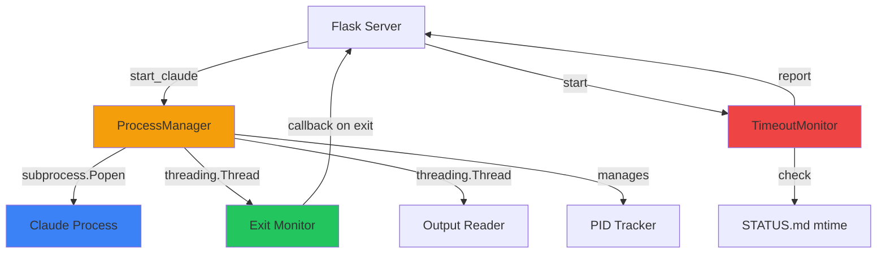

# Process Management

This document describes how the Simple Claude Conductor Web UI manages Claude subprocess execution, including PID tracking, output capture, timeout detection, and platform-specific considerations.

## Overview

The ProcessManager provides reliable subprocess control for running Claude CLI commands. It addresses common Windows subprocess issues (PID tracking, console windows) while maintaining clean process lifecycle management.

## Architecture



## ProcessManager Class

**Location**: `server/process_manager.py`

**Purpose**: Manage Claude subprocess lifecycle with proper PID tracking and monitoring.

### Core Design Principles

1. **Direct Spawn**: Use `subprocess.Popen` directly, NOT via `cmd /c start`
2. **PID Tracking**: Maintain actual PID of claude.exe for reliable control
3. **Exit Detection**: Monitor process completion and trigger callbacks
4. **Console Management**: On Windows, use CREATE_NEW_CONSOLE for visibility
5. **Thread Safety**: Use threading.RLock for concurrent access

### Why NOT cmd /c start?

**Problem with cmd /c start**:
```python
# WRONG - returns cmd.exe's PID, not claude.exe's PID
subprocess.Popen(['cmd', '/c', 'start', 'claude', '-p', 'prompt'])
```

When you use `cmd /c start`, the process tree looks like:
```
cmd.exe (PID 1000) - exits immediately
  └─ claude.exe (PID 1001) - actual process
```

Your code only has PID 1000, which is already dead. You can't track, kill, or wait on claude.exe.

**Solution - Direct Spawn**:
```python
# CORRECT - returns claude.exe's PID
subprocess.Popen(['claude', '-p', 'prompt'],
                 creationflags=subprocess.CREATE_NEW_CONSOLE)
```

Process tree:
```
python.exe (PID 500)
  └─ claude.exe (PID 1001) - PID tracked by parent
```

### Windows CREATE_NEW_CONSOLE Flag

**Purpose**: Give Claude its own console window without losing PID tracking.

**Flag**: `subprocess.CREATE_NEW_CONSOLE` (0x00000010)

**Effect**:
- Claude spawns in a new console window
- User can see Claude's output and interact with it
- Parent process still tracks the PID
- Can call `.wait()`, `.terminate()`, `.kill()` on the process

**Trade-off**: When using CREATE_NEW_CONSOLE, we can't capture stdout/stderr. But visibility is more important for this use case.

**Code Example**:
```python
if sys.platform == 'win32':
    kwargs['creationflags'] = subprocess.CREATE_NEW_CONSOLE
    # Remove stdout/stderr capture when using new console
    del kwargs['stdout']
    del kwargs['stderr']
```

### Key Methods

#### start_claude(prompt: str, working_dir: str, new_console: bool = True) → int

**Purpose**: Start Claude subprocess with given prompt

**Parameters**:
- `prompt`: Command/prompt to send to Claude (e.g., "Generate a plan")
- `working_dir`: Project root directory (CWD for subprocess)
- `new_console`: Whether to open new console window (Windows only)

**Returns**: Process ID (PID) of claude.exe

**Raises**:
- `RuntimeError` if Claude already running
- `RuntimeError` if Claude CLI not found in PATH

**Implementation**:
```python
def start_claude(self, prompt: str, working_dir: str, new_console: bool = True) -> int:
    with self._lock:
        if self.is_running():
            raise RuntimeError("Claude is already running")

        # Build command
        cmd = ['claude', '-p', prompt]

        # Platform-specific subprocess kwargs
        kwargs = {
            'cwd': working_dir,
            'stdout': subprocess.PIPE,
            'stderr': subprocess.STDOUT,
            'text': True,
            'bufsize': 1,  # Line buffered
        }

        if sys.platform == 'win32':
            if new_console:
                kwargs['creationflags'] = subprocess.CREATE_NEW_CONSOLE
                # Can't capture output with new console
                del kwargs['stdout']
                del kwargs['stderr']
                del kwargs['text']
                del kwargs['bufsize']

        try:
            self.process = subprocess.Popen(cmd, **kwargs)
            self.start_time = datetime.now()
        except FileNotFoundError:
            raise RuntimeError(
                "Claude CLI not found. Please ensure 'claude' is installed and in PATH."
            )

        # Start output reader thread (only if capturing)
        if 'stdout' in kwargs:
            self.output_thread = threading.Thread(
                target=self._read_output,
                daemon=True
            )
            self.output_thread.start()

        # Start exit monitor thread
        monitor_thread = threading.Thread(
            target=self._monitor_exit,
            daemon=True
        )
        monitor_thread.start()

        return self.process.pid
```

**Example Usage**:
```python
process_manager = ProcessManager()
pid = process_manager.start_claude('Generate a plan', '/path/to/project')
print(f"Claude started with PID {pid}")
```

#### is_running() → bool

**Purpose**: Check if Claude subprocess is currently running

**Returns**: True if process running, False otherwise

**Implementation**:
```python
def is_running(self) -> bool:
    if self.process is None:
        return False
    # poll() returns None if running, return code if finished
    return self.process.poll() is None
```

**Example Usage**:
```python
if process_manager.is_running():
    print("Claude is running")
else:
    print("Claude is stopped")
```

#### get_pid() → Optional[int]

**Purpose**: Get process ID if running

**Returns**: PID or None if not running

**Example Usage**:
```python
pid = process_manager.get_pid()
if pid:
    print(f"Claude PID: {pid}")
```

#### get_return_code() → Optional[int]

**Purpose**: Get process exit code

**Returns**: Return code if finished, None if still running

**Example Usage**:
```python
code = process_manager.get_return_code()
if code is not None:
    if code == 0:
        print("Completed successfully")
    else:
        print(f"Failed with code {code}")
```

#### stop(timeout: float = 10.0) → bool

**Purpose**: Stop Claude gracefully with timeout

**Parameters**:
- `timeout`: Seconds to wait before force kill

**Returns**: True if stopped cleanly, False if force killed

**Implementation**:
```python
def stop(self, timeout: float = 10.0) -> bool:
    if not self.is_running():
        return True

    with self._lock:
        # Try graceful termination first (SIGTERM)
        self.process.terminate()

        try:
            self.process.wait(timeout=timeout)
            return True  # Terminated gracefully
        except subprocess.TimeoutExpired:
            # Force kill (SIGKILL)
            self.process.kill()
            self.process.wait()
            return False  # Had to force kill
```

**Example Usage**:
```python
stopped_cleanly = process_manager.stop(timeout=10.0)
if not stopped_cleanly:
    print("Warning: Had to force kill the process")
```

#### on_exit(callback: Callable[[int], None]) → None

**Purpose**: Register callback to be called when process exits

**Parameters**:
- `callback`: Function taking return code as argument

**Example Usage**:
```python
def handle_exit(return_code):
    if return_code == 0:
        print("Claude completed successfully")
    else:
        print(f"Claude failed with code {return_code}")

process_manager.on_exit(handle_exit)
```

**How It Works**:
1. `_monitor_exit()` thread calls `process.wait()` (blocks until exit)
2. When process exits, thread calls registered callback
3. Callback runs in monitor thread (not main thread)

#### get_recent_output(max_lines: int = 50) → List[str]

**Purpose**: Get recent output lines (non-blocking)

**Note**: Only works if not using CREATE_NEW_CONSOLE (output capture enabled)

**Returns**: List of output lines (up to max_lines)

**Example Usage**:
```python
output = process_manager.get_recent_output(max_lines=10)
for line in output:
    print(line)
```

#### get_runtime_seconds() → Optional[float]

**Purpose**: Get how long the process has been running

**Returns**: Runtime in seconds or None if not started

**Example Usage**:
```python
runtime = process_manager.get_runtime_seconds()
if runtime:
    print(f"Claude has been running for {runtime:.1f} seconds")
```

### Internal Methods

#### _read_output() → None

**Purpose**: Background thread that reads subprocess stdout line by line

**Implementation**:
```python
def _read_output(self) -> None:
    try:
        if self.process and self.process.stdout:
            for line in self.process.stdout:
                self.output_queue.put(line.rstrip())
    except Exception:
        pass
```

**Note**: This thread terminates when stdout is closed (process exits).

#### _monitor_exit() → None

**Purpose**: Background thread that waits for process exit and triggers callback

**Implementation**:
```python
def _monitor_exit(self) -> None:
    if self.process is None:
        return

    # Wait for process to complete (blocks)
    return_code = self.process.wait()

    # Trigger callback if set
    if self._on_exit_callback:
        try:
            self._on_exit_callback(return_code)
        except Exception:
            pass
```

## TimeoutMonitor Class

**Location**: `server/process_manager.py`

**Purpose**: Detect stalled or hung Claude processes by monitoring STATUS.md file modification time.

### Timeout Thresholds

```python
STALL_THRESHOLD = 5 * 60   # 5 minutes without update = stalled
HARD_TIMEOUT = 30 * 60    # 30 minutes total = timeout
```

**Stalled**: Claude hasn't updated STATUS.md in 5+ minutes (may be stuck)

**Timed Out**: Claude has been running for 30+ minutes total (hard limit)

### Key Methods

#### start() → None

**Purpose**: Mark process start time

**Example Usage**:
```python
timeout_monitor = TimeoutMonitor('/path/to/STATUS.md')
timeout_monitor.start()
```

#### stop() → None

**Purpose**: Clear process start time (when process ends)

**Example Usage**:
```python
timeout_monitor.stop()
```

#### check() → dict

**Purpose**: Check for timeout conditions

**Returns**:
```python
{
    'stalled': bool,         # True if no STATUS.md update for 5+ min
    'timed_out': bool,       # True if running for 30+ min
    'last_update': str,      # ISO8601 timestamp of last STATUS.md update
    'runtime': float         # Seconds since start() was called
}
```

**Implementation**:
```python
def check(self) -> dict:
    now = datetime.now()

    # Get STATUS.md modification time
    last_update = None
    try:
        if os.path.exists(self.status_file):
            mtime = os.path.getmtime(self.status_file)
            last_update = datetime.fromtimestamp(mtime)
    except OSError:
        pass

    # Calculate runtime
    runtime = None
    if self.process_start:
        runtime = (now - self.process_start).total_seconds()

    # Check conditions
    stalled = False
    if last_update:
        seconds_since_update = (now - last_update).total_seconds()
        stalled = seconds_since_update > self.STALL_THRESHOLD

    timed_out = False
    if runtime:
        timed_out = runtime > self.HARD_TIMEOUT

    return {
        'stalled': stalled,
        'timed_out': timed_out,
        'last_update': last_update.isoformat() if last_update else None,
        'runtime': runtime
    }
```

**Example Usage**:
```python
info = timeout_monitor.check()
if info['stalled']:
    print(f"Warning: No updates for {info['runtime']:.0f} seconds")
if info['timed_out']:
    print("Error: Process has exceeded 30 minute limit")
```

## Integration with Flask

### Starting a Process

```python
@app.route('/api/actions/generate-plan', methods=['POST'])
def action_generate_plan():
    if process_manager.is_running():
        return jsonify({'error': 'Claude is already running'}), 400

    # Update state
    state_manager.set_state('planning', activity='Generating plan...')
    timeout_monitor.start()

    # Start Claude
    pid = process_manager.start_claude('Generate a plan', PROJECT_ROOT)
    state_manager.set_process(pid)

    # Register exit callback
    def on_exit(return_code):
        if return_code == 0:
            # Success - detect plan
            phase_count, phase_names = detect_plan_phases()
            if phase_count > 0:
                state_manager.set_state('planned',
                                       phase=1,
                                       total_phases=phase_count,
                                       phase_name=phase_names[0])
            else:
                state_manager.set_state('configured',
                                       activity='No phases found')
        else:
            # Error
            state_manager.set_error(f'Claude exited with code {return_code}')

        state_manager.set_process(None)
        timeout_monitor.stop()

    process_manager.on_exit(on_exit)

    return jsonify({'success': True, 'pid': pid})
```

### Streaming Status via SSE

```python
@app.route('/api/events')
def events():
    def generate():
        while True:
            # Get state from StateManager
            state = state_manager.get_state()

            # Add process status
            state['claudeRunning'] = process_manager.is_running()
            state['processPid'] = process_manager.get_pid()

            # Add timeout info
            timeout_info = timeout_monitor.check()
            state['stalled'] = timeout_info.get('stalled', False)
            state['timedOut'] = timeout_info.get('timed_out', False)

            # Send as SSE event
            yield f"data: {json.dumps(state)}\n\n"

            time.sleep(1)  # Update every second

    return Response(generate(), mimetype='text/event-stream')
```

### Canceling a Process

```python
@app.route('/api/actions/cancel', methods=['POST'])
def action_cancel():
    was_running = process_manager.is_running()

    # Stop process
    stopped_cleanly = process_manager.stop(timeout=10.0)

    # Update state
    state = state_manager.get_state()
    current = state.get('state')

    if current == 'planning':
        state_manager.set_state('configured', activity='Plan generation cancelled')
    elif current in ('executing', 'questions'):
        state_manager.set_state('planned', activity='Execution cancelled')

    state_manager.set_process(None)
    timeout_monitor.stop()

    return jsonify({
        'success': True,
        'wasRunning': was_running,
        'stoppedCleanly': stopped_cleanly
    })
```

## Platform Considerations

### Windows

**CREATE_NEW_CONSOLE**:
- Required for visible Claude console
- Can't capture stdout when used
- PID tracking works correctly

**Path Handling**:
- Claude must be in PATH
- Subprocess uses system PATH lookup

**Signal Handling**:
- `.terminate()` sends SIGTERM (or Windows equivalent)
- `.kill()` sends SIGKILL (or Windows equivalent)
- Ctrl+C in Flask terminal triggers graceful_shutdown handler

### macOS / Linux

**Console**:
- No CREATE_NEW_CONSOLE equivalent
- Claude runs in background
- Can capture stdout normally

**Signal Handling**:
- `.terminate()` sends SIGTERM (15)
- `.kill()` sends SIGKILL (9)
- Ctrl+C sends SIGINT to Flask, triggering handler

## Graceful Shutdown

The Flask server has a graceful shutdown handler:

```python
def graceful_shutdown(signum, frame):
    print("\n\nShutting down gracefully...")

    # Terminate Claude if running
    if process_manager.is_running():
        print("  Stopping Claude process...")
        process_manager.stop(timeout=5)

    print("  Server stopped.")
    sys.exit(0)

# Register handlers
signal.signal(signal.SIGINT, graceful_shutdown)
signal.signal(signal.SIGTERM, graceful_shutdown)
```

**Behavior**:
1. User presses Ctrl+C
2. SIGINT triggers graceful_shutdown
3. Stop Claude with 5 second timeout
4. Exit Flask cleanly

## Error Handling

### Claude Not Found

**Symptom**: FileNotFoundError when starting process

**Cause**: `claude` not in PATH

**Solution**:
```python
try:
    pid = process_manager.start_claude('prompt', cwd)
except RuntimeError as e:
    if 'not found' in str(e).lower():
        # Show error to user: Install Claude CLI
        state_manager.set_error('Claude CLI not found. Please run: claude login')
```

### Process Already Running

**Symptom**: RuntimeError "Claude is already running"

**Cause**: Trying to start second process while first still running

**Solution**: Check `is_running()` before starting

**Frontend Handling**: Disable action buttons while process running

### Process Crashes

**Symptom**: Exit callback called with non-zero code

**Handling**:
```python
def on_exit(return_code):
    if return_code != 0:
        # Get recent output if available
        output = process_manager.get_recent_output(max_lines=20)
        error_msg = f'Claude crashed with exit code {return_code}'
        if output:
            error_msg += f'\n\nRecent output:\n' + '\n'.join(output[-5:])

        state_manager.set_error(error_msg)
```

### Timeout / Stall

**Detection**: TimeoutMonitor detects via `check()`

**Response**:
```python
timeout_info = timeout_monitor.check()
if timeout_info['timed_out']:
    # Hard timeout - force stop
    process_manager.stop(timeout=5)
    state_manager.set_error('Process exceeded 30 minute timeout')
elif timeout_info['stalled']:
    # Soft warning - show in UI but don't stop
    # User can manually cancel if needed
    pass
```

## Best Practices

1. **Always Check is_running() Before Starting**:
   ```python
   if process_manager.is_running():
       return error_response("Already running")
   ```

2. **Always Register Exit Callback**:
   ```python
   process_manager.on_exit(handle_exit)
   ```

3. **Always Clear Process State on Exit**:
   ```python
   def on_exit(code):
       # ... handle completion ...
       state_manager.set_process(None)
       timeout_monitor.stop()
   ```

4. **Use Timeouts When Stopping**:
   ```python
   stopped = process_manager.stop(timeout=10.0)
   if not stopped:
       log.warning("Had to force kill process")
   ```

5. **Monitor for Timeouts in UI**:
   ```python
   # SSE stream includes timeout info
   state['stalled'] = timeout_monitor.check()['stalled']
   ```

## Testing Considerations

### Unit Tests

**Test Process Lifecycle**:
```python
def test_start_stop():
    pm = ProcessManager()
    pid = pm.start_claude('test', '/tmp')
    assert pm.is_running()
    assert pm.get_pid() == pid
    pm.stop()
    assert not pm.is_running()
```

**Test Exit Callback**:
```python
def test_exit_callback():
    called = []
    def callback(code):
        called.append(code)

    pm = ProcessManager()
    pm.on_exit(callback)
    pm.start_claude('echo test', '/tmp')
    time.sleep(2)  # Wait for exit
    assert len(called) == 1
    assert called[0] == 0
```

### Integration Tests

**Test with Real Claude**:
- Requires Claude CLI installed
- Use short-running commands
- Mock subprocess.Popen for faster tests

## Related Documentation

- [ARCHITECTURE.md](ARCHITECTURE.md) - Overall system design
- [STATE_MACHINE.md](STATE_MACHINE.md) - State transitions triggered by process events
- [API_REFERENCE.md](API_REFERENCE.md) - API endpoints that control processes
- [DEPLOYMENT.md](DEPLOYMENT.md) - Installation and troubleshooting
