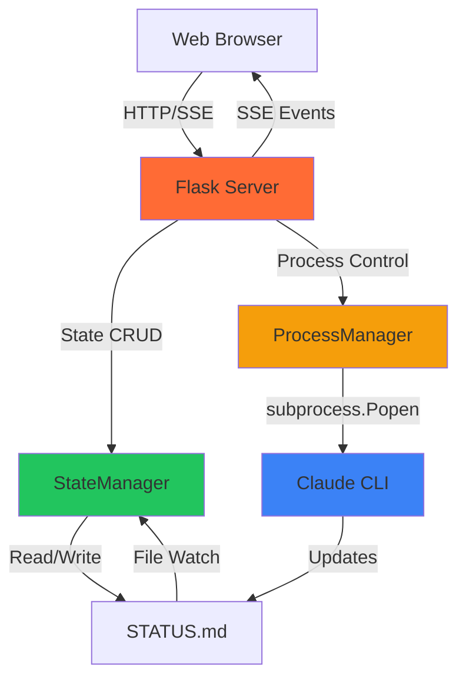

# Simple Claude Conductor Web UI

A Flask-based web interface for managing Claude Code projects, designed for non-technical users who prefer a GUI over terminal commands.

## Overview

Simple Claude Conductor Web UI (v2.0) provides a browser-based interface to:
- Configure projects with drag-and-drop file references
- Generate execution plans from natural language descriptions
- Execute plans with real-time progress tracking
- Answer questions from Claude during execution
- View results and manage project archives

The system uses a robust state machine architecture with file-based persistence, subprocess management with proper PID tracking, and real-time updates via Server-Sent Events (SSE).

## Features

### Project Management
- **Configuration UI**: Name your project, describe what you want to build, select model (haiku/sonnet/opus)
- **Reference Files**: Drag-and-drop files that Claude should reference during planning
- **Archive System**: Automatically archives completed projects with timestamps
- **Reset Capability**: Start fresh projects while preserving old work

### Execution Workflow
- **Plan Generation**: Claude generates a multi-phase execution plan from your description
- **Real-time Progress**: Stage-based progress indicator and phase completion tracking
- **Questions Handling**: Web UI for answering Claude's clarifying questions
- **Activity Feed**: See what Claude is doing in real-time

### State Persistence
- **YAML Frontmatter**: STATUS.md uses YAML frontmatter as single source of truth
- **File-based State**: No database required, state persists across server restarts
- **Thread-safe Operations**: Safe concurrent access with optional file locking

### Process Management
- **PID Tracking**: Proper subprocess tracking on Windows
- **Timeout Detection**: Automatic detection of stalled or hung processes
- **Graceful Shutdown**: Clean process termination with timeout handling

### Frontend
- **Alpine.js**: Lightweight reactive framework (no build step)
- **SSE Updates**: Real-time state synchronization every second
- **Dark Theme**: Modern, accessible design with CSS custom properties
- **Mobile Responsive**: Works on desktop, tablet, and mobile

## Quick Start

### Prerequisites
- Python 3.8+
- Claude CLI installed and authenticated (`claude login`)
- Modern web browser (Chrome, Firefox, Safari, Edge)

### Running the Server

1. **Navigate to project root**:
   ```bash
   cd /path/to/AIPM
   ```

2. **Start the server**:
   ```bash
   python server/app.py
   ```

3. **Open your browser**:
   ```
   http://localhost:8080
   ```

4. **Configure your project**:
   - Enter project name and description
   - Upload any reference files (optional)
   - Click "Generate Plan"

5. **Execute the plan**:
   - Review the generated plan
   - Click "Execute Plan"
   - Answer any questions Claude asks
   - View results in the output folder

### Stopping the Server

Press `Ctrl+C` in the terminal where the server is running.

## Architecture Overview



**Data Flow**:
1. User triggers action in browser (e.g., "Generate Plan")
2. Frontend calls REST API endpoint
3. Flask updates StateManager and starts ProcessManager
4. ProcessManager spawns Claude subprocess with proper PID tracking
5. Claude writes updates to STATUS.md
6. StateManager detects changes and updates internal state
7. Flask streams state to browser via SSE
8. Frontend reactively updates UI

## File Structure

```
AIPM/
├── server/
│   ├── app.py                  # Flask application with 38 REST endpoints
│   ├── state_manager.py        # State machine with YAML frontmatter
│   ├── process_manager.py      # Subprocess management with PID tracking
│   ├── templates/
│   │   └── conductor.html      # Main UI template
│   └── static/
│       ├── js/
│       │   ├── app.js          # Alpine.js application
│       │   └── api.js          # API client with SSE support
│       └── css/
│           └── conductor.css   # Design system and components
├── docs/
│   ├── SimpleClaudeConductorDocumentation/  # This documentation
│   └── planning/               # Planning files (task-plan.md, findings.md, etc.)
├── config/
│   └── project-config.json     # Project configuration
├── File_References_For_Your_Project/  # User-uploaded reference files
├── output/                     # Generated deliverables
├── archive/                    # Archived projects
├── STATUS.md                   # Current state (YAML frontmatter + markdown)
├── Questions_For_You.md        # Questions from Claude
└── project.yaml                # Project settings
```

## Key Concepts

### State Machine
The application uses an 8-state machine:
- **reset** - Initial state, ready to start
- **configured** - Project configured, ready to generate plan
- **planning** - Claude is generating plan
- **planned** - Plan ready, can execute
- **executing** - Claude is executing plan
- **questions** - Claude has questions needing answers
- **complete** - Project complete
- **error** - Error occurred, can retry

See [STATE_MACHINE.md](STATE_MACHINE.md) for full state diagram and transitions.

### YAML Frontmatter Persistence
STATUS.md contains both:
- **YAML frontmatter** (structured state for machines)
- **Markdown body** (human-readable progress for users)

This dual format serves as the single source of truth, readable by both code and humans.

### SSE Real-time Updates
The frontend maintains an EventSource connection to `/api/events` which:
- Streams state updates every second
- Auto-reconnects on connection loss
- Merges server state with local state
- Drives reactive UI updates

## Related Documentation

- [ARCHITECTURE.md](ARCHITECTURE.md) - Component design and data flow
- [STATE_MACHINE.md](STATE_MACHINE.md) - Complete state machine specification
- [PROCESS_MANAGEMENT.md](PROCESS_MANAGEMENT.md) - Subprocess handling and PID tracking
- [API_REFERENCE.md](API_REFERENCE.md) - All 38 REST endpoints with examples
- [FRONTEND.md](FRONTEND.md) - Alpine.js structure and UI patterns
- [CONFIGURATION.md](CONFIGURATION.md) - Configuration file formats
- [DEPLOYMENT.md](DEPLOYMENT.md) - Installation and troubleshooting

## Version History

**v2.0** (Current)
- Rebuilt with StateManager for proper state machine
- ProcessManager with actual PID tracking (no cmd /c start wrapper)
- SSE for real-time updates
- Alpine.js frontend (replaced Bootstrap)
- YAML frontmatter persistence
- Timeout monitoring

**v1.0**
- Initial implementation
- Basic Flask server
- jQuery-based UI
- File polling for state

## License

Part of the Simple Claude Conductor project.

## Support

For issues or questions:
- Check [DEPLOYMENT.md](DEPLOYMENT.md) for troubleshooting
- Review [API_REFERENCE.md](API_REFERENCE.md) for endpoint details
- Inspect STATUS.md for current state information
