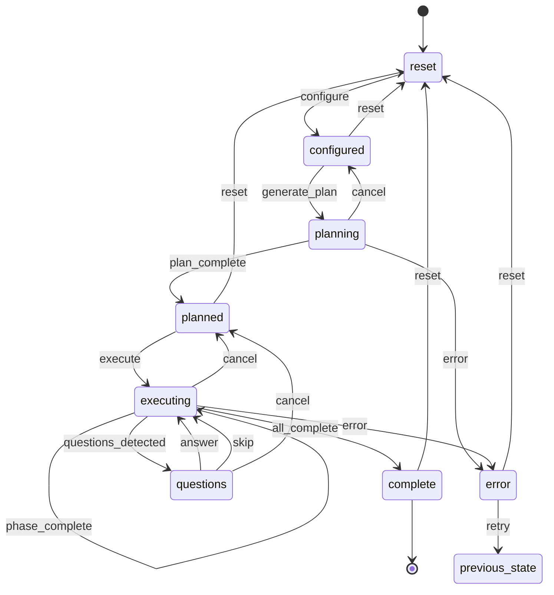

# State Machine

This document describes the state machine that governs the Simple Claude Conductor Web UI application lifecycle.

## Overview

The application uses a finite state machine with 8 states and well-defined transitions. State is persisted in STATUS.md using YAML frontmatter, providing both a machine-readable structure and human-readable progress log.

## State Diagram



## States

### reset
**Initial state when server starts or project is reset.**

**Characteristics**:
- No plan generated
- No process running
- phase = 0, total_phases = 0
- activity = "Ready to start"

**User Actions Available**:
- Configure project (name, description, model)
- Upload reference files
- Generate plan (once configured)

**Next States**: configured (via configure action)

---

### configured
**Project is configured and ready to generate a plan.**

**Characteristics**:
- project-config.json exists
- phase = 0, total_phases = 0
- activity = "Project configured. Ready to generate plan."

**User Actions Available**:
- Generate plan
- Edit configuration
- Reset to start over

**Next States**:
- planning (via generate_plan action)
- reset (via reset action)

---

### planning
**Claude is generating an execution plan.**

**Characteristics**:
- Process running (PID tracked)
- phase = 0, total_phases = 0
- activity = "Generating plan... A terminal window will appear - you can ignore it."
- Claude writes to docs/planning/task-plan.md

**User Actions Available**:
- Cancel (stops Claude process)
- Wait for completion

**Automatic Transitions**:
- On process exit with code 0 → planned (if phases detected in task-plan.md)
- On process exit with code 0 → configured (if no phases found)
- On process exit with non-zero code → error

**Next States**:
- planned (via plan_complete action)
- configured (via cancel action)
- error (via error action)

---

### planned
**Plan is generated and ready to execute.**

**Characteristics**:
- total_phases > 0 (from task-plan.md)
- phase = 1
- phase_name set to first phase name
- activity = "Plan generated with X phase(s). Ready to execute!"

**User Actions Available**:
- Execute plan
- Open plan file to review
- Reset to start over

**Next States**:
- executing (via execute action)
- reset (via reset action)

---

### executing
**Claude is executing the plan phases.**

**Characteristics**:
- Process running (PID tracked)
- phase increments as phases complete
- phase_name updates for current phase
- activity describes current operation
- Claude writes to output/ and updates STATUS.md

**User Actions Available**:
- Cancel (stops execution, returns to planned state)
- Wait for completion or questions

**Automatic Transitions**:
- If Questions_For_You.md has unanswered questions → questions
- On phase completion → executing (stays in state, phase increments)
- On all phases complete → complete
- On error → error

**Next States**:
- questions (via questions_detected action)
- executing (via phase_complete action, phase increments)
- complete (via all_complete action)
- planned (via cancel action)
- error (via error action)

---

### questions
**Claude needs user input to continue.**

**Characteristics**:
- Questions_For_You.md contains unanswered questions
- phase and total_phases preserved from executing state
- activity = "Claude has questions for you"
- Process may or may not be running (waits for Enter keypress)

**User Actions Available**:
- Answer questions and continue
- Skip questions (let Claude decide)
- Cancel (return to planned state)

**Questions File Format**:
```markdown
## Questions

### Question 1: [Topic]
[Question text]

**Your Answer:** _____

### Question 2: [Topic]
[Question text]

**Your Answer:** _____
```

**Next States**:
- executing (via answer or skip action, starts continue command)
- planned (via cancel action)

---

### complete
**All phases executed successfully.**

**Characteristics**:
- phase = total_phases
- activity = "Project complete! Click 'Open Output' to review your deliverables."
- output/ folder contains deliverables
- cost_report.md may be generated

**User Actions Available**:
- Open output folder
- View cost report
- Start new project (reset)

**Next States**:
- reset (via reset action, which archives current project)

---

### error
**An error occurred during planning or execution.**

**Characteristics**:
- error field contains error message
- previous_state contains state before error occurred
- activity describes the error
- Process not running

**User Actions Available**:
- Retry (returns to previous_state)
- Reset (start over)

**Next States**:
- [previous_state] (via retry action)
- reset (via reset action)

## Transitions

All transitions are defined in `server/state_manager.py:TRANSITIONS` dict.

### From reset

| Action | Next State | Trigger |
|--------|-----------|---------|
| configure | configured | User saves project config |

### From configured

| Action | Next State | Trigger |
|--------|-----------|---------|
| generate_plan | planning | User clicks "Generate Plan" |
| reset | reset | User clicks reset |

### From planning

| Action | Next State | Trigger |
|--------|-----------|---------|
| plan_complete | planned | Claude exits with code 0, phases detected |
| cancel | configured | User cancels operation |
| error | error | Claude exits with non-zero code |

### From planned

| Action | Next State | Trigger |
|--------|-----------|---------|
| execute | executing | User clicks "Execute Plan" |
| reset | reset | User clicks reset |

### From executing

| Action | Next State | Trigger |
|--------|-----------|---------|
| questions_detected | questions | Questions_For_You.md has unanswered questions |
| phase_complete | executing | Phase completes, more phases remain |
| all_complete | complete | All phases complete |
| cancel | planned | User cancels execution |
| error | error | Claude exits with non-zero code |

### From questions

| Action | Next State | Trigger |
|--------|-----------|---------|
| answer | executing | User submits answers and continues |
| skip | executing | User skips questions and continues |
| cancel | planned | User cancels |

### From complete

| Action | Next State | Trigger |
|--------|-----------|---------|
| reset | reset | User starts new project (archives current) |

### From error

| Action | Next State | Trigger |
|--------|-----------|---------|
| retry | previous_state | User clicks retry |
| reset | reset | User clicks reset |

## StateManager Implementation

The `StateManager` class in `server/state_manager.py` manages state persistence and transitions.

### Key Methods

#### get_state() → Dict[str, Any]

**Purpose**: Read current state from STATUS.md

**Returns**:
```python
{
    'state': str,                # Current state name
    'phase': int,                # Current phase (0 if no plan)
    'total_phases': int,         # Total phases (0 if no plan)
    'phase_name': str | None,    # Current phase name
    'process_id': int | None,    # Claude PID if running
    'process_start': str | None, # ISO8601 timestamp
    'last_updated': str,         # ISO8601 timestamp
    'error': str | None,         # Error message if in error state
    'previous_state': str | None,# State before error
    'activity': str              # Human-readable activity message
}
```

**Implementation**:
1. Opens STATUS.md
2. Parses YAML frontmatter using `yaml.safe_load()`
3. Falls back to regex parsing for legacy formats
4. Returns DEFAULT_STATE if file missing or malformed

#### set_state(new_state: str, **kwargs) → Dict[str, Any]

**Purpose**: Directly set state (for initialization or recovery)

**Parameters**:
- `new_state`: One of the 8 valid states
- `**kwargs`: Additional fields to update (phase, error, activity, etc.)

**Validation**: Raises `ValueError` if `new_state` not in `VALID_STATES`

**Side Effects**:
- Updates `last_updated` to current time
- Writes entire STATUS.md file with new YAML frontmatter

**Example**:
```python
state_manager.set_state('planned',
                        phase=1,
                        total_phases=5,
                        phase_name='Read and Catalog Source Files',
                        activity='Plan generated with 5 phase(s). Ready to execute!')
```

#### transition(action: str, **kwargs) → Dict[str, Any]

**Purpose**: Perform a validated state transition

**Parameters**:
- `action`: Transition action (must be valid from current state)
- `**kwargs`: Additional fields to update

**Validation**:
- Checks if `action` is valid from current state using `TRANSITIONS` dict
- Raises `ValueError` if transition not allowed

**Special Handling**:
- For `error` action: Saves current state to `previous_state`
- For `retry` action: Returns to `previous_state`

**Example**:
```python
# Valid transition
state_manager.transition('plan_complete',
                         phase=1,
                         total_phases=5,
                         phase_name='Phase 1')

# Invalid transition (raises ValueError)
state_manager.transition('execute')  # Can't execute from reset state
```

#### update_phase(phase: int, total: int, name: str = None)

**Purpose**: Update phase progress without changing state

**Use Case**: During execution, increment phase as phases complete

**Example**:
```python
state_manager.update_phase(phase=2, total=5, name='Create Documentation')
```

#### set_error(error_message: str)

**Purpose**: Transition to error state with message

**Shorthand for**:
```python
state_manager.transition('error', error=error_message)
```

#### set_process(pid: int | None)

**Purpose**: Update running process information

**Parameters**:
- `pid`: Process ID or None if no process

**Side Effects**:
- Sets `process_start` to current time if PID provided
- Clears `process_start` if PID is None

### Thread Safety

**Mechanism**: Uses `threading.RLock` for internal synchronization

**Optional File Locking**: If `portalocker` is installed, uses file locks for atomic read/write

**Code Example**:
```python
with self._lock:  # Thread lock
    state = self.get_state()
    state['phase'] += 1
    self._write_state(state)  # Uses file lock if portalocker available
```

## YAML Frontmatter Format

STATUS.md uses YAML frontmatter to store structured state:

```yaml
---
activity: Ready to start
error: null
last_updated: '2026-01-26T10:00:00.000000'
phase: 0
phase_name: null
previous_state: null
process_id: null
process_start: null
state: reset
total_phases: 0
---
# Project Status: [Project Name]

**Last Updated**: 2026-01-26 10:00

---

## 👉 WHAT TO DO NEXT

Ready to start

---

## Quick Status

| Item | Status |
|------|--------|
| Plan Generated | No |
| Current Phase | - |
| Phases Completed | 0 / 0 |

---

## Progress Log

_State managed by StateManager_
```

**Key Design Points**:

1. **YAML Frontmatter**: Delimited by `---`, parsed by `yaml.safe_load()`
2. **Markdown Body**: Human-readable, generated from YAML fields
3. **Atomic Writes**: Entire file written on every state change
4. **Single Source of Truth**: Both Claude and Flask read/write this file

## State Detection Logic

StateManager uses multiple strategies to detect state:

### Primary: YAML Frontmatter

If `---` found at start of file, parse as YAML and use `state` field directly.

### Fallback: Regex Parsing (Legacy)

For backward compatibility with old STATUS.md formats:

1. **Phase Detection**: `Phase (\d+) of (\d+)` → sets phase and total_phases
2. **Completion Detection**: `Phases Completed | X / Y` where X == Y → state = 'complete'
3. **Questions Detection**: "Questions_For_You.md" in activity → state = 'questions'
4. **Execution Detection**: "Executing" or "In Progress" → state = 'executing'
5. **Planning Detection**: "Plan Generated | Yes" → state = 'planned'

### Default State

If file doesn't exist or is malformed: Returns `DEFAULT_STATE` (reset state).

## Error Recovery

### Automatic Recovery

StateManager doesn't automatically recover from errors. The error state must be cleared by user action.

### Manual Recovery

**Retry**: Return to previous_state
```python
state_manager.transition('retry')
```

**Reset**: Start fresh
```python
state_manager.set_state('reset',
                        phase=0,
                        total_phases=0,
                        error=None,
                        activity='Ready to start')
```

### Stuck State Recovery

If state machine gets stuck (e.g., process crashed, file corrupted):

1. **Option 1**: Edit STATUS.md YAML frontmatter directly
2. **Option 2**: Call `POST /api/actions/reset` to force reset
3. **Option 3**: Delete STATUS.md and restart server

## State Transition Examples

### Happy Path: Complete Workflow

```python
# 1. Initial state
state_manager.set_state('reset')

# 2. User configures project
state_manager.set_state('configured', activity='Project configured')

# 3. User clicks "Generate Plan"
state_manager.transition('generate_plan')
# state = 'planning'

# 4. Claude finishes generating plan
state_manager.transition('plan_complete',
                         phase=1,
                         total_phases=3,
                         phase_name='Setup')
# state = 'planned'

# 5. User clicks "Execute Plan"
state_manager.transition('execute')
# state = 'executing'

# 6. Phase 1 completes
state_manager.update_phase(2, 3, 'Implementation')
# state still 'executing', phase = 2

# 7. Phase 2 completes
state_manager.update_phase(3, 3, 'Testing')
# state still 'executing', phase = 3

# 8. All phases complete
state_manager.transition('all_complete')
# state = 'complete'

# 9. User starts new project
state_manager.set_state('reset', phase=0, total_phases=0)
# state = 'reset'
```

### Error Path: Plan Generation Fails

```python
# 1. User clicks "Generate Plan"
state_manager.transition('generate_plan')
# state = 'planning'

# 2. Claude exits with error
state_manager.set_error('Claude CLI not found in PATH')
# state = 'error', previous_state = 'planning'

# 3. User fixes issue and retries
state_manager.transition('retry')
# state = 'configured' (previous_state)

# 4. User tries again
state_manager.transition('generate_plan')
# state = 'planning'
```

### Questions Path: Claude Needs Input

```python
# User clicks "Execute Plan"
state_manager.transition('execute')
# state = 'executing'

# Claude writes questions, execution pauses
state_manager.transition('questions_detected',
                         activity='Claude has questions for you')
# state = 'questions'

# User answers and continues
state_manager.transition('answer')
# state = 'executing'
```

## Related Documentation

- [ARCHITECTURE.md](ARCHITECTURE.md) - System architecture overview
- [PROCESS_MANAGEMENT.md](PROCESS_MANAGEMENT.md) - Process lifecycle integration
- [API_REFERENCE.md](API_REFERENCE.md) - State API endpoints
- [FRONTEND.md](FRONTEND.md) - Frontend state binding
