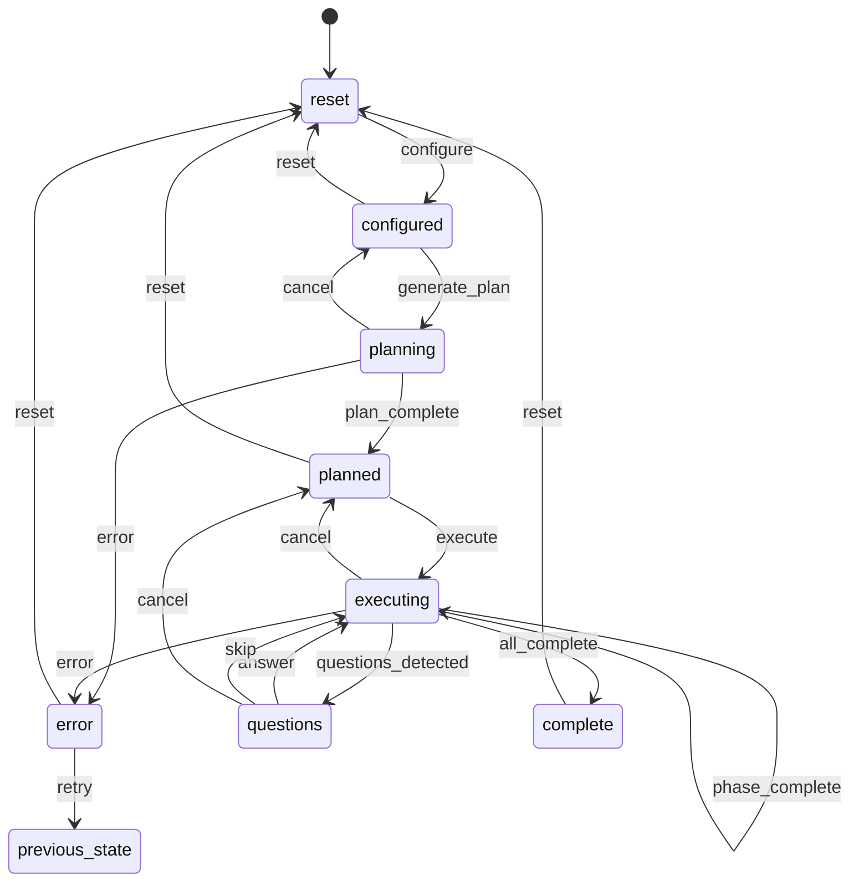

# File References

## Source Files Cataloged

| File | Lines | Description |
|------|-------|-------------|
| server/app.py | 1123 | Flask application with 38 REST endpoints, SSE support, error handlers |
| server/state_manager.py | 461 | StateManager class with YAML frontmatter persistence, state machine with 8 states and transitions |
| server/process_manager.py | 353 | ProcessManager for Claude subprocess, TimeoutMonitor for stall detection |
| server/static/js/app.js | 573 | Alpine.js conductorApp() with reactive state, SSE integration, 11 computed properties |
| server/static/js/api.js | 171 | APIClient class with SSE support, fetch wrapper, convenience methods for all endpoints |
| server/static/css/conductor.css | 636 | Design system with CSS custom properties, dark theme, component styles |
| server/templates/conductor.html | ~300 | Main UI template with Alpine.js directives (read earlier in session) |

## Key Components

### Backend Architecture

**Flask App Structure**:
- Error handlers (2)
- Main routes (2)
- SSE endpoint (1)
- State API (2)
- Action API (6)
- Configuration API (3)
- Reference Files API (4)
- Questions API (3)
- Claude Control API (3)
- Legacy endpoints (3)
- Cost Report API (2)
- Archive API (4)
- Output API (2)
- System API (1)
- Server Management (1)

**StateManager**:
- Single source of truth: STATUS.md with YAML frontmatter
- 8 states: reset, configured, planning, planned, executing, questions, complete, error
- Thread-safe operations with RLock
- Optional file locking with portalocker
- State transition validation
- Legacy format parsing for backward compatibility

**ProcessManager**:
- Direct subprocess.Popen (no cmd /c start wrapper)
- Windows CREATE_NEW_CONSOLE for separate console window
- Exit callback mechanism
- Output capture via queue
- Graceful shutdown with timeout

**TimeoutMonitor**:
- Stall detection: 5 minutes without STATUS.md update
- Hard timeout: 30 minutes total runtime
- Monitors file modification time

### Frontend Architecture

**Alpine.js App**:
- Single component: conductorApp()
- SSE-driven reactive state
- 11 computed properties
- File upload with drag-and-drop
- Questions form with textarea inputs
- Stage-based progress indicator

**APIClient**:
- SSE connection with auto-reconnect
- Generic fetch wrapper with error handling
- Convenience methods for all 38 endpoints
- FormData upload for reference files

**CSS Design System**:
- CSS custom properties (design tokens)
- Dark theme (body: #111827, card: #1f2937)
- Primary color: #ff6b35 (orange)
- Mobile-first responsive design
- Component library: cards, buttons, forms, progress, dropzone

## State Machine Diagram (Mermaid)



## API Endpoint Summary

**Action Endpoints** (trigger state transitions):
- POST /api/actions/generate-plan
- POST /api/actions/execute
- POST /api/actions/continue
- POST /api/actions/cancel
- POST /api/actions/retry
- POST /api/actions/reset

**Resource Endpoints** (read/write data):
- GET/POST /api/config
- GET /api/questions
- POST /api/questions/answer
- POST /api/questions/skip
- GET /api/references
- POST /api/references/upload
- POST /api/references/archive

**System Endpoints** (system operations):
- GET /api/claude/check
- GET /api/plan/open
- GET /api/output/open
- GET /api/archive/open
- POST /api/shutdown

**Real-time Endpoint**:
- GET /api/events (SSE stream, 1 second interval)

## Configuration Files

**project-config.json** (stored in config/):
```json
{
  "projectName": "string",
  "projectDescription": "string",
  "defaultModel": "haiku|sonnet|opus"
}
```

**STATUS.md** (YAML frontmatter + markdown body):
```yaml
---
state: string
phase: number
total_phases: number
phase_name: string|null
process_id: number|null
process_start: ISO8601|null
last_updated: ISO8601
error: string|null
previous_state: string|null
activity: string
---
# Project Status: [Project Name]
...
```

## Documentation Files to Create

1. **README.md** - Overview, features, quick start, file structure
2. **ARCHITECTURE.md** - Component diagram, data flow, state persistence
3. **STATE_MACHINE.md** - States, transitions, StateManager implementation
4. **PROCESS_MANAGEMENT.md** - ProcessManager, PID tracking, Windows specifics
5. **API_REFERENCE.md** - All 38 endpoints with examples
6. **FRONTEND.md** - Alpine.js structure, SSE connection, design system
7. **CONFIGURATION.md** - project.yaml schema, config file formats
8. **DEPLOYMENT.md** - Running the server, troubleshooting

## Exclusions

The following directories are NOT documented (archived/old code):
- archive/
- .claude/
- Bootstrap/
- python-portable/
- scripts/ (except reference to generate_cost_report.py)
